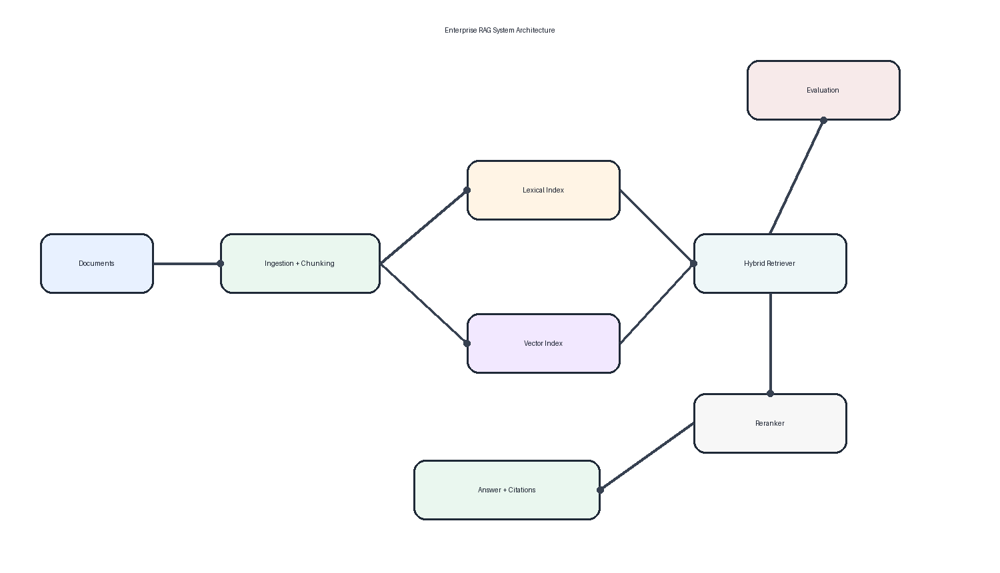

# Enterprise RAG System

*[English version](README.en.md)*

[](https://github.com/lucianoon/enterprise-rag-system/actions/workflows/ci.yml)
[](LICENSE)
[](https://render.com/deploy?repo=https://github.com/lucianoon/enterprise-rag-system)

**[Demo ao vivo](https://enterprise-rag-demo.onrender.com/docs)** — API
interativa com o corpus de exemplo carregado; experimente o `POST /query` e o
`POST /evaluate/batch` direto do navegador (free tier: o primeiro acesso pode
levar ~1 min para acordar).

Um motor de RAG que trata a qualidade da recuperação como o problema principal:
busca híbrida (lexical no estilo BM25 + vetorial) com fusão de scores, um passe
de reranking heurístico (sobreposição de título e frase exata — não é
cross-encoder), respostas com citações e um endpoint de avaliação embutido que
reporta **Recall@K** e **MRR** para qualquer consulta rotulada. Toda resposta
expõe os scores de cada estágio, então dá para ver *por que* um trecho foi
recuperado, não apenas *que* ele foi.

## Evidências rápidas

| Evidência | O que demonstra |
|---|---|
| 55 funções de teste offline | API, auth, recuperação, backends e avaliação |
| Dataset rotulado e versionado | Recall@K e MRR reproduzíveis |
| Scores por estágio | Diagnóstico de falhas de recuperação |
| Hashing/TF-IDF/sentence-transformers | CI determinística e backend semântico real |
| Memória/Qdrant | Mesma interface do teste local à infraestrutura externa |
| Juiz heurístico ou LLM | Avaliação de fidelidade com fallback explícito |

> **Não é o mesmo projeto que o [RAG Agentic System](https://github.com/lucianoon/rag-agentic-system).**
> Este motor recupera **uma vez** e responde; o objetivo de projeto é uma lista
> ranqueada cuja qualidade você consegue medir. O outro embrulha a recuperação
> em um **loop de tool use com Claude**, em que o modelo decide quando buscar de
> novo. Problemas diferentes: este repo otimiza qualidade de ranqueamento,
> aquele otimiza raciocínio em múltiplos passos sobre um corpus.

## Problema

A maior parte das falhas de RAG é falha de recuperação. Busca puramente
semântica perde termos exatos que dominam consultas corporativas — nomes de
política, IDs, siglas, linguagem de compliance —, enquanto busca puramente por
palavra-chave perde paráfrases. E sem métricas de recuperação, não dá para saber
se uma resposta ruim veio do gerador ou da lista ranqueada que ele recebeu.

Este projeto trata a recuperação como o núcleo mensurável do sistema:

- fundir evidência lexical e vetorial em vez de apostar em um único sinal
- manter os componentes de score transparentes de ponta a ponta
- fazer da avaliação Recall@K / MRR uma operação de primeira classe da API, não
  um acessório

## Solução

Um pipeline compacto e totalmente tipado (`src/enterprise_rag_system/`):

| Estágio | Módulo | O que faz de fato |
|---|---|---|
| Ingestão | `ingestion.py` | Carrega documentos JSONL e os divide em chunks de tamanho fixo por contagem de palavras (padrão: 80 palavras) |
| Recuperação lexical | `retrieval.py` | Score no estilo BM25: casamento de termos ponderado por IDF com frequência em escala logarítmica |
| Embeddings | `embeddings.py` | Backends plugáveis: hashing determinístico (padrão offline/CI), TF-IDF (scikit-learn) ou vetores semânticos densos (sentence-transformers) |
| Vector store | `vector_store.py` | Backends plugáveis: busca por cosseno exata em memória ou um índice Qdrant real (o que o `docker compose` sobe) |
| Fusão de scores | `retrieval.py` | Score híbrido ponderado: `0.55 * lexical + 0.45 * vetorial` |
| Reranking | `retrieval.py` | Reforça resultados pela sobreposição de tokens entre consulta e título, mais um bônus de frase exata no título |
| Geração | `generation.py` | Claude sintetiza uma resposta fundamentada com citações entre colchetes; um gerador determinístico por template é o fallback offline/CI |
| Citações | `pipeline.py` | Toda resposta traz `doc_id` / `title` / `chunk_id` de cada trecho de apoio |
| Avaliação | `evaluation.py` | Recall@K e MRR por consulta rotulada, mais avaliação em lote sobre um dataset versionado com métricas agregadas |
| API | `api.py` | Serviço FastAPI: `/health`, `/query`, `/evaluate`, `/evaluate/batch`, auth opcional por API key |

As *interfaces* de recuperação (chunks entram, sai um `SearchResult` com
`lexical_score` / `vector_score` / `hybrid_score` / `rerank_score`) são o ponto
central: o mesmo pipeline roda contra os backends offline sem dependências ou
contra Qdrant + embeddings reais, escolhidos puramente por variáveis de
ambiente.

## Arquitetura



```text
Documentos JSONL
      |
      v
Ingestão -> chunks por contagem de palavras
      |
      +----------------------+
      |                      |
      v                      v
Índice lexical (IDF)   Embedder -> Vector store
                       (hashing|tfidf|st)  (memory|qdrant)
      |                      |
      +----- fusão de scores +
      |   0.55*lex + 0.45*vet
      v
Reranker (sobreposição de título + bônus de frase exata)
      |
      v
Gerador de resposta (Claude, fallback determinístico) + citações
      |
      v
Avaliador (Recall@K, MRR)  <- consultas rotuladas via /evaluate
```

Mais detalhes em [docs/architecture.md](docs/architecture.md) (em inglês).

## Início rápido

Requer Python 3.12+.

```bash
git clone https://github.com/lucianoon/enterprise-rag-system.git
cd enterprise-rag-system
uv sync --extra dev              # núcleo: roda totalmente offline
uv sync --extra dev --extra extras   # opcional: qdrant-client + scikit-learn

uv run pytest -q                 # 55 testes, sem rede, sem chave de API
uv run ruff check . && uv run mypy   # mesmos gates que o CI aplica
uv run uvicorn enterprise_rag_system.api:app --port 8000
```

As versões vêm de `uv.lock`, então o ambiente local, o CI e a imagem Docker
resolvem exatamente as mesmas dependências.

Ou com make: `make install && make test && make dev`. Com Docker:
`docker compose up --build` sobe a API ligada a uma instância real do Qdrant
(`RAG_VECTOR_STORE=qdrant`, `RAG_EMBEDDING_BACKEND=tfidf`).

A API sobe já com o corpus de exemplo embutido (`data/sample/policies.jsonl` —
políticas de reembolso, segurança e SLA), então dá para consultar de imediato.

### Modos de geração de resposta

Defina `RAG_LLM_MODE` (veja `.env.example`):

- `auto` (padrão) — usa o modelo quando há backend configurado, senão o
  template determinístico
- `llm` — sempre chama o modelo (veja [Trocando de modelo ou de provedor](#trocando-de-modelo-ou-de-provedor))
- `deterministic` — sempre usa o template offline (é o que a CI roda)

Um erro transitório da API cai no fallback determinístico, então
`/query` nunca falha de forma dura (a falha é logada com traceback completo). O
modo ativo é reportado como `generation_mode` nos metadados da resposta.

### Trocando de modelo ou de provedor

O acesso ao LLM passa por uma porta única (`llm_client.py`) com dois backends
atrás da mesma interface — o gerador de resposta e o juiz de fidelidade usam os
dois igualmente:

| Variável | Valores |
|---|---|
| `RAG_LLM_BACKEND` | `auto` (padrão), `anthropic`, `openai` |
| `RAG_LLM_MODEL` | id do modelo; default `claude-opus-5` ou `gpt-4.1-mini` |
| `RAG_LLM_BASE_URL` | endpoint OpenAI-compatible (também aceita `OPENAI_BASE_URL`) |
| `RAG_LLM_API_KEY` | credencial; cai para `OPENAI_API_KEY` / `ANTHROPIC_API_KEY` |

No modo `auto`: chave da Anthropic ⇒ `anthropic`; senão base URL ou chave OpenAI
⇒ `openai`; sem nada, o pipeline usa o gerador determinístico.

```bash
# OpenRouter, Groq, Together, DeepInfra, Fireworks…
export RAG_LLM_BASE_URL=https://openrouter.ai/api/v1
export RAG_LLM_API_KEY=sk-or-v1-...
export RAG_LLM_MODEL=meta-llama/llama-3.3-70b-instruct

# Ollama local — sem credencial nenhuma
export RAG_LLM_BASE_URL=http://localhost:11434/v1
export RAG_LLM_MODEL=llama3.1
```

O backend OpenAI-compatible vem no extra `extras`.

### Backends de recuperação

Os dois estágios de recuperação são escolhidos por variáveis de ambiente (veja
`.env.example`):

- `RAG_EMBEDDING_BACKEND` — `hashing` (padrão: determinístico, zero
  dependências, estável entre processos), `tfidf` (scikit-learn, ajustado no
  corpus indexado), `sentence-transformer` (vetores semânticos densos, pesado)
  ou `auto` (o melhor disponível).
- `RAG_VECTOR_STORE` — `memory` (padrão: busca exata por cosseno em processo) ou
  `qdrant` (usa `QDRANT_URL` e `COLLECTION_NAME`; o `docker compose` já liga
  isso).
- `RAG_API_KEY` — quando definida, `/query` e `/evaluate*` exigem o mesmo valor
  no cabeçalho `X-API-Key`. Sem ela, acesso aberto para desenvolvimento local.

## Avaliação: Recall@K e MRR

A qualidade da recuperação é avaliada por consulta rotulada através da API (ou
pelo `RetrievalEvaluator` em código):

```bash
curl -X POST http://localhost:8000/evaluate \
  -H "Content-Type: application/json" \
  -d '{
        "question": "What is the SLA for high priority support tickets?",
        "relevant_doc_ids": ["policy_sla"],
        "top_k": 3
      }'
```

Resposta (trecho):

```json
{
  "recall_at_k": 1.0,
  "mrr": 1.0,
  "retrieved_doc_ids": ["policy_sla", "policy_refunds", "policy_security"],
  "query": { "answer": "...", "citations": [...], "results": [...] }
}
```

Como ler os números:

- **Recall@K** — fração dos documentos rotulados como relevantes que aparecem em
  qualquer posição das top-K citações. `1.0` significa que tudo que era
  relevante foi recuperado; recall baixo significa que o gargalo é o retriever,
  não o gerador.
- **MRR** — rank recíproco do *primeiro* acerto relevante. `1.0` = documento
  relevante em primeiro lugar, `0.5` = segundo, `0.33` = terceiro, `0.0` =
  não apareceu. Recall alto com MRR baixo aponta para os pesos de
  fusão/ranqueamento ou para o reranker, não para a geração de candidatos.

Cada `SearchResult` também devolve seu `lexical_score`, `vector_score`,
`hybrid_score` e `rerank_score`, então dá para rastrear um ranqueamento ruim até
o estágio exato que o causou.

> O corpus de exemplo e o dataset de avaliação estão em inglês, então as
> consultas dos exemplos acima também estão. Aponte `RAG_EVAL_DATASET` para o
> seu próprio JSONL para avaliar um corpus em português.

### Avaliação em lote sobre um dataset versionado

Um dataset rotulado acompanha o repositório (`data/eval/retrieval_v1.jsonl` — 10
consultas contra o corpus de exemplo). Rode pela API ou pela CLI:

```bash
curl -X POST http://localhost:8000/evaluate/batch \
  -H "Content-Type: application/json" -d '{"top_k": 3}'

python -m enterprise_rag_system.evaluation --top-k 1     # ou: make eval
```

O relatório traz `mean_recall_at_k`, `mean_mrr` e métricas por consulta, então
uma mudança nos pesos de fusão, no chunking ou no reranker aparece como um diff
mensurável em vez de uma impressão. Aponte `RAG_EVAL_DATASET` para o seu próprio
JSONL (`{"query_id", "question", "relevant_doc_ids"}` por linha) para avaliar um
corpus real.

### Fidelidade da resposta

As métricas de recuperação param na lista ranqueada; `/evaluate/answer` julga o
que o *gerador* fez com ela — a fração de afirmações da resposta que estão
apoiadas nas passagens recuperadas, mais as afirmações sem apoio na íntegra:

```bash
curl -X POST http://localhost:8000/evaluate/answer \
  -H "Content-Type: application/json" \
  -d '{"question": "What must a refund request include?", "top_k": 3}'
```

Dois juízes compartilham a mesma interface, escolhidos por `RAG_JUDGE_MODE`
(`answer_eval.py`):

- `heuristic` (padrão) — contenção lexical sentença a sentença contra o
  contexto. Determinístico e offline: um proxy barato de groundedness que a CI
  consegue usar como gate, não uma verificação de implicação semântica.
- `llm` — Claude pontua a fidelidade e lista as afirmações sem apoio
  (`RAG_JUDGE_MODEL` sobrescreve o modelo). Cai no juiz heurístico em caso de
  erro de API, reportado como `judge_mode: "heuristic-fallback"`.

### Trade-offs de recuperação, explicitados

- **Pesos de fusão** (`0.55` lexical / `0.45` vetorial) favorecem levemente a
  terminologia corporativa exata sobre o casamento por paráfrase — ajuste por
  corpus e reconfira o MRR.
- **Pool de candidatos**: o pipeline recupera `2 * top_k` candidatos antes do
  reranking; é um botão de recall vs. latência.
- **Embeddings hasheados por padrão** trocam qualidade semântica por
  determinismo e zero infraestrutura — ideal para CI e para isolar o
  comportamento lexical vs. vetorial; os backends `tfidf` e
  `sentence-transformer` oferecem semântica de produção atrás da mesma
  interface.
- **O reranker** é uma heurística barata (sobreposição de título + frase exata),
  não um cross-encoder; melhora a precisão em consultas com cara de título sem
  adicionar dependência de modelo.

## API

| Endpoint | Método | Descrição |
|---|---|---|
| `/health` | GET | Verificação de liveness (sempre aberto) |
| `/query` | POST | `{question, top_k}` → resposta fundamentada, citações, scores por estágio, metadados de latência |
| `/evaluate` | POST | `{question, relevant_doc_ids, top_k}` → Recall@K, MRR, IDs recuperados, resposta completa da consulta |
| `/evaluate/batch` | POST | `{top_k}` → Recall@K / MRR agregados sobre o dataset de avaliação versionado |
| `/evaluate/answer` | POST | `{question, top_k}` → responde a pergunta e então julga a fidelidade da resposta contra o próprio contexto recuperado |

Quando `RAG_API_KEY` está definida, todos os endpoints exceto `/health` exigem o
cabeçalho `X-API-Key`.

```bash
curl -X POST http://localhost:8000/query \
  -H "Content-Type: application/json" \
  -d '{"question":"What does the refund policy require?","top_k":3}'
```

Os metadados da resposta incluem `query_id`, `latency_ms`, `top_k`,
`result_count` e `generation_mode`. Todos os contratos de request/response são
modelos Pydantic em
[`models.py`](src/enterprise_rag_system/models.py).

## Testes

```bash
pytest -q
```

Os testes cobrem os endpoints da API (incluindo auth e erros de validação),
unidades de recuperação, todos os backends de embedding e de vector store (o
Qdrant roda em modo `:memory:`), avaliação em lote e o comportamento de seleção
e fallback do gerador. Rodam inteiramente offline — os caminhos determinísticos
de embedding e de geração significam que a CI não precisa de segredos, que é
exatamente como o [`.github/workflows/ci.yml`](.github/workflows/ci.yml) os
executa.

## Qualidade e contribuição

Mudanças no retriever, chunking, fusão de scores ou reranking devem trazer um
comparativo reproduzível. O [protocolo de benchmark](docs/BENCHMARKING.md)
define dataset, comandos, métricas e o formato de relatório — sem publicar
números que não tenham sido executados.

Contribuições são bem-vindas. Consulte [CONTRIBUTING.md](CONTRIBUTING.md); os
templates de issue coletam ambiente e reprodução, e o template de pull request
exige os mesmos gates da CI e evidência de regressão para mudanças de recuperação.

## Roadmap

- Reranker com cross-encoder
- Avaliação de qualidade de resposta em lote (fidelidade agregada sobre o
  dataset de avaliação)
- Indexação incremental em vez de reindexação completa na inicialização

## Licença

[MIT](LICENSE) — © 2026 Luciano de Oliveira Nunes.
